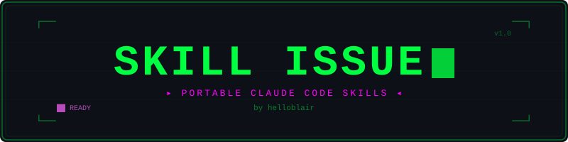

<p align="center">
  
</p>

A personal library of reusable [Claude Code](https://docs.anthropic.com/en/docs/claude-code) skills and hooks, portable across any project.

## What's in here?

Two kinds of Claude Code extension:

- **Skills** (`skills/<name>/SKILL.md`) — reusable instructions Claude loads when they're relevant. Modern Claude Code has a single Skill concept: a skill is both model-invoked (Claude reads its description and uses it when it fits) and user-invoked (you can run it directly with `/<name>`). There is no longer a separate "command" type, and the old `/project:<name>` / `/user:<name>` syntax is gone.
- **Hooks** (`hooks/`) — small scripts the Claude Code harness runs mechanically on an event (configured in `settings.json`). Because the harness runs them, not the model, they fire reliably every time. Hooks are not skills and are not symlinked into `~/.claude/skills/`; you wire them up in your settings.

## Skills

### takeaway
A manually triggered learning journal (`/takeaway [topic]`). Reviews the current conversation, reconstructs what just happened step by step in plain language, and appends it to `takeaways.md`. Study notes and interview prep. Append-only.

### doc-logging
On-demand, deliberate project documentation (`/doc-logging`). Writes the rich parts a script cannot: a sprint changelog (what changed, WHY, the tradeoffs) and a component-by-component codebase audit (the project's current-state map). This is the deep-dive companion to the `activity-log` hook below.

### rag-pipeline
A reference guide and pattern library for building Retrieval-Augmented Generation pipelines: file discovery, language-aware chunking, embeddings, vector storage (Pinecone), retrieval, and cited answer generation, plus a troubleshooting catalog.

### vercel-deploy
A deployment checklist and troubleshooting guide for shipping Next.js apps to Vercel: project setup, environment variables, API routes, function duration limits, and the dev-to-production workflow.

## Hooks

### activity-log
The automatic "what changed" feed. A `PostToolUse` hook that appends one terse, timestamped line per file change Claude makes to `<project>/docs/activity-log.md`, plus a marker when a `git commit` runs. Logs paths and line counts only (never file contents), skips noise, and hides itself from git locally via `.git/info/exclude`. See [`hooks/README.md`](hooks/README.md) for setup and details.

## The two-tier documentation system

`doc-logging` and `activity-log` are designed to work together to answer "what is going on with my code?" at two levels:

- The **`activity-log` hook** gives you the always-on, reliable *feed*: every change, as it happens, terse.
- The **`doc-logging` skill** gives you the *depth* on demand: the "why" behind a change and the big-picture map, the parts a script cannot produce.

Use the hook for breadcrumbs, the skill for the occasional deep entry.

## Usage

These instructions assume the repo is cloned at `~/skill-issue`. If you clone it elsewhere, adjust the paths (the hook command also points at `~/skill-issue`).

### Install skills

Skills are discovered as `<name>/SKILL.md` folders. Symlink the ones you want into `~/.claude/skills/` (global, every project) or a project's `.claude/skills/`.

```bash
mkdir -p ~/.claude/skills

# All of them
for s in ~/skill-issue/skills/*/; do
  ln -s "$s" ~/.claude/skills/"$(basename "$s")"
done

# Or just the ones you want
ln -s ~/skill-issue/skills/takeaway     ~/.claude/skills/takeaway
ln -s ~/skill-issue/skills/doc-logging  ~/.claude/skills/doc-logging
```

Restart Claude Code (or start a new session) so it picks up the new skills.

### Install the activity-log hook

The hook lives in `settings.json`, not in `~/.claude/skills/`. Add this to `~/.claude/settings.json` (global) or a project's `.claude/settings.local.json` (one project only):

```json
{
  "hooks": {
    "PostToolUse": [
      {
        "matcher": "Edit|Write|NotebookEdit|Bash",
        "hooks": [
          { "type": "command", "command": "test -f \"$HOME/skill-issue/hooks/activity-log.py\" && python3 \"$HOME/skill-issue/hooks/activity-log.py\" || true" }
        ]
      }
    ]
  }
}
```

Claude Code loads hooks at startup, so start a new session (or, in the terminal CLI, review via `/hooks`) to activate it. Full details in [`hooks/README.md`](hooks/README.md).

## Adding new extensions

- **A new skill:** create `skills/<name>/SKILL.md` with frontmatter (`name`, `description`, optional `argument-hint`), then symlink it into `~/.claude/skills/`. Update this README.
- **A new hook:** add a script under `hooks/`, document it in `hooks/README.md`, and reference it from your `settings.json`. Update this README.
